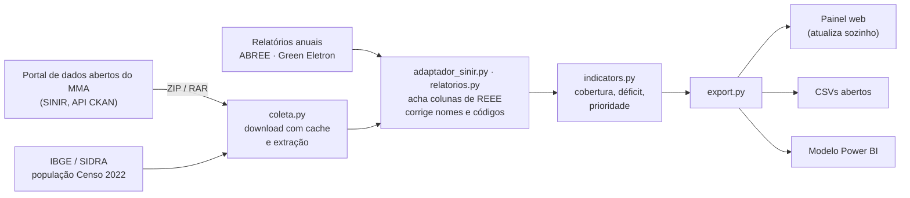

# Painel REEE Brasil

**Onde o Brasil descarta seus eletrônicos, e onde ainda falta lugar para isso.**

Protótipo de dashboard que acompanha a logística reversa de **resíduos de equipamentos eletroeletrônicos (REEE)** com dados do **SINIR (2019–2025)** e do **Censo 2022**. A mesma base de dados atende a dois públicos:

| Para o **gestor público** | Para o **cidadão** |
|---|---|
| Quantos pontos de recebimento existem e quantos a lei exige em cada estado | A situação da sua cidade, em linguagem simples |
| Comparação com as metas do Decreto 10.240/2020 | Cidades vizinhas com ponto de coleta |
| Ranking de onde instalar os próximos pontos | Como descartar e o que é aceito |
| Séries por entidade gestora (ABREE, Green Eletron) | Formulário para sugerir pontos e avaliar o painel |

    

---

## O que os dados reais já mostram

Com os relatórios de 2022 da ABREE e da Green Eletron publicados no SINIR e a população do Censo 2022:

- **6.149 pontos de recebimento informados** no país, para **5.139 exigidos** pela regra do Decreto (1 ponto a cada 25 mil habitantes nos municípios acima de 80 mil). No total nacional, a regra é cumprida em número.
- **A distribuição é desigual.** O Rio Grande do Sul tem 3 vezes o número exigido (302 %) e a Bahia mais que o dobro (217 %). Já o **Amapá tem 26 %** do exigido, o **Ceará 45 %** e **Roraima 47 %**.
- **19.960 toneladas** foram coletadas em 2022 pelas duas entidades.
- **O SINIR não publica número de pontos por município.** O módulo Estados e Municípios só traz os planos de gestão de resíduos em texto livre. O painel transforma esses textos num indicador municipal: quais prefeituras declararam ações para eletroeletrônicos, e com que palavras.

> Os números são por estado porque é assim que as entidades publicam. Para dados por município, o painel usa automaticamente o módulo Estados e Municípios do SINIR quando consegue baixá-lo (veja [De onde vêm os dados](#de-onde-vêm-os-dados)).

---

## Começo rápido

Você precisa do **Python 3.10 ou mais novo**. Todos os comandos rodam **a partir da pasta raiz do projeto** (onde está este README), nunca de dentro de `src\reee`.

**Windows (PowerShell)**

```powershell
cd C:\Users\PC\Documents\tcc
python -m venv .venv
.venv\Scripts\activate
pip install -r requirements.txt
python iniciar.py
```

**Linux / macOS**

```bash
cd ~/tcc
python3 -m venv .venv
source .venv/bin/activate
pip install -r requirements.txt
python iniciar.py
```

O navegador abre sozinho em **http://localhost:8000**. Na primeira execução, o servidor busca os dados oficiais em segundo plano, e a barra de status no topo do painel mostra cada etapa.

---

## Comandos

| Quero... | Comando |
|---|---|
| Abrir o painel e atualizar os dados se estiverem velhos | `python iniciar.py` |
| Abrir o painel só com os dados que já estão no projeto | `python iniciar.py --sem-atualizar` |
| Usar outra porta | `python iniciar.py --porta 8080` |
| Abrir sem lançar o navegador | `python iniciar.py --sem-navegador` |
| Considerar os dados velhos depois de N dias (padrão: 7) | `python iniciar.py --validade 30` |
| Ver o painel com dados sintéticos, sem internet | `python iniciar.py --demo --sem-atualizar` |
| Baixar e processar os dados oficiais, sem abrir o painel | `python iniciar.py pipeline --coletar` |
| Baixar tudo de novo, ignorando o cache | `python iniciar.py pipeline --coletar --forcar` |
| Reprocessar o que já foi baixado | `python iniciar.py pipeline` |
| Gerar só os dados de demonstração | `python iniciar.py pipeline --demo` |
| Rodar os testes | `python -m pytest` |

> **Cuidado com `--demo`.** Ele substitui os dados reais do painel pelos sintéticos. Para voltar aos reais, rode `python iniciar.py pipeline`.

<details>
<summary>Alternativa: instalar o pacote (sem o atalho <code>iniciar.py</code>)</summary>

```powershell
pip install -e .
python -m reee.servidor            # mesmo que python iniciar.py
python -m reee.pipeline --coletar  # mesmo que python iniciar.py pipeline --coletar
```

Depois do `pip install -e .`, os comandos `reee-painel` e `reee-pipeline` também ficam disponíveis no terminal.
</details>

---

## Como funciona



1. **Coleta.** Consulta a API do portal do MMA, baixa os arquivos anuais do SINIR e a população do IBGE. Os downloads ficam em cache e só são refeitos quando o arquivo muda na fonte.
2. **Tratamento.** Lê planilhas com layouts diferentes a cada ano. O pipeline acha a linha de cabeçalho, a coluna de código IBGE e as colunas de eletroeletrônicos. Também converte números no formato brasileiro (`1.234,56`) e corrige nomes de municípios grafados errado (por exemplo, "Guarupuava" → Guarapuava).
3. **Indicadores.** Calcula pontos por 100 mil habitantes, pontos exigidos pela regra do Decreto, déficit, cobertura e índice de prioridade. Município que não informou dados fica **sem informação**, nunca com zero.
4. **Publicação.** Grava o pacote do painel de forma atômica (o painel nunca lê um arquivo pela metade), além dos dados abertos e do relatório de qualidade.

---

## De onde vêm os dados

| Fonte | O que traz | Situação no projeto |
|---|---|---|
| **IBGE – Censo 2022** (SIDRA, tabela 4709) | População dos 5.570 municípios | **Incluída** em `data/raw/ibge/populacao.csv`. A soma é 203.080.756, o total oficial, e cada estado bate com seu total. |
| **ABREE – Relatório 2022** | Pontos 2021/2022, municípios atendidos e toneladas, por estado | **Incluída** em `data/raw/sinir/relatorios/`. Os totais conferem com os impressos no relatório. |
| **Green Eletron – Relatórios 2022 e 2023** | 2022: lista de 266 municípios com seus PEVs. 2023: PEVs e municípios por estado | **Incluída.** Os totais conferem, inclusive os regionais. |
| **SINIR – Módulo Estados e Municípios** (2019–2025) | Planos de gestão de resíduos declarados por estados e municípios | **Baixada automaticamente** por `python iniciar.py`. Não traz números de REEE; o painel lê os **textos** das metas e soluções e mostra quais municípios citam ações para eletroeletrônicos, com o trecho como evidência. |

A proveniência de cada número (documento, URL e conferência) está em `data/raw/sinir/relatorios/fontes.json` e aparece na aba **Dados abertos** do painel.

**Lacunas conhecidas:**
- **2019 e 2020:** só há totais nacionais da ABREE (16 t e 51 t).
- **2023:** só a Green Eletron publicou. O relatório da ABREE remete os números a um anexo que não foi publicado.
- **2024 e 2025:** nenhum relatório no SINIR até 08/10/2026.
- **Municípios atendidos:** um município atendido pelas duas entidades conta duas vezes na soma.

---

## Quando o adaptador erra uma coluna

As planilhas do SINIR são declarações dos municípios e mudam de formato a cada ano. Depois de cada coleta, confira o arquivo **`data/processed/inventario_sinir.md`**. Ele lista cada aba lida e a coluna escolhida para cada campo, com uma pontuação de confiança.

Se alguma escolha estiver errada, indique a coluna certa em `data/raw/sinir/mapeamento.json`:

```json
{
  "*":    { "pontos": "Quantidade de PEVs de eletroeletrônicos" },
  "2023": { "toneladas": "Massa coletada de REEE (t)", "cod_ibge": "Cód. Município" }
}
```

A chave `"*"` vale para todos os anos; um ano específico sobrepõe. Depois, rode `python iniciar.py pipeline`.

---

## Problemas comuns

| Mensagem | Causa e solução |
|---|---|
| `ModuleNotFoundError: No module named 'reee'` | O comando foi rodado de dentro de `src\reee`. Volte para a raiz (`cd C:\Users\PC\Documents\tcc`) e use `python iniciar.py`. |
| `ImportError: attempted relative import with no known parent package` | O arquivo foi executado direto (`python pipeline.py`). Use `python iniciar.py pipeline`. |
| `Cannot convert non-finite values (NA or inf) to integer` | Versão antiga do adaptador, que juntava os dígitos de células de texto longas. Atualize `src/reee/adaptador_sinir.py` e `src/reee/utils.py`. |
| `sem acesso a dados.mma.gov.br` | O computador está sem internet ou atrás de um proxy. O painel continua funcionando com os dados já incluídos. |
| `Não foi possível extrair o RAR` | O arquivo de 2025 vem em RAR. Instale o [7-Zip](https://www.7-zip.org/) e rode de novo. |
| A página abre, mas sem gráficos | As bibliotecas d3 e Chart.js vêm de CDN e precisam de internet na primeira abertura. |
| A porta 8000 está ocupada | `python iniciar.py --porta 8080` |

---

## Estrutura

```
├── iniciar.py              atalho: abre o painel ou roda o pipeline, de qualquer pasta
├── src/reee/
│   ├── coleta.py           download: API do MMA (CKAN) e IBGE (SIDRA), cache, ZIP/RAR
│   ├── adaptador_sinir.py  lê as planilhas do SINIR e gera o inventário
│   ├── relatorios.py       relatórios das entidades: conferência e casamento de nomes
│   ├── planos_sinir.py     planos municipais: o texto cita eletroeletrônicos? (com trecho)
│   ├── extract.py          leitura tolerante de CSV/XLSX (encoding, separador)
│   ├── transform.py        limpeza e georreferenciamento por código IBGE
│   ├── indicators.py       indicadores por município, estado e Brasil
│   ├── export.py           dados abertos, Power BI e pacote do painel
│   ├── pipeline.py         orquestra as etapas
│   ├── servidor.py         servidor local com /api/status e /api/atualizar
│   ├── demo.py             gerador de dados sintéticos no formato do SINIR
│   └── config.py           anos, regras do Decreto, apelidos de colunas, pesos
├── dashboard/              site estático (index.html, css/, js/, data/)
├── data/raw/               entradas: ibge/, geo/, sinir/ (relatorios/, downloads)
├── data/processed/         saídas tratadas, powerbi/, qualidade.json, inventário
├── docs/                   referencial teórico, metodologia e avaliação
├── notebooks/              análise exploratória em Pandas
└── tests/                  36 testes, incluindo um portal MMA/IBGE simulado
```

---

## Objetivos do trabalho

| Objetivo | Onde está |
|---|---|
| **I.** Mapear os conceitos de logística reversa de REEE, cidades inteligentes e e-Democracia | [`docs/01_referencial_teorico.md`](docs/01_referencial_teorico.md) |
| **II.** Extrair e tratar os dados do SINIR (2019–2025) com Python e Pandas | [`src/reee/`](src/reee), [`docs/02_metodologia.md`](docs/02_metodologia.md), [`notebooks/01_exploracao.ipynb`](notebooks/01_exploracao.ipynb) |
| **III.** Implementar o dashboard (Python, HTML5, CSS3, JS e GitHub; Power BI como alternativa) | [`dashboard/`](dashboard), [`data/processed/powerbi/`](data/processed/powerbi), [`.github/workflows/pages.yml`](.github/workflows/pages.yml) |
| **IV.** Avaliar a dupla entrega para o gestor e para o cidadão | [`docs/03_avaliacao.md`](docs/03_avaliacao.md) e o questionário embutido no painel |

---

## Publicar no GitHub Pages

1. Crie o repositório e envie o código (`git push`).
2. Em **Settings › Pages**, escolha **GitHub Actions** como fonte.
3. O workflow [`pages.yml`](.github/workflows/pages.yml) roda os testes, faz a coleta oficial, trata os dados e publica a pasta `dashboard/`. Ele roda a cada push e todo dia 1º do mês. Se o portal do MMA estiver fora do ar, publica os dados de demonstração e registra um aviso. O inventário das planilhas fica disponível como artefato da execução.

No Pages o painel é estático: a atualização acontece pelo agendamento, e o botão "Atualizar dados" só aparece no servidor local.

---

## Antes de citar no TCC

- **Metas do Decreto.** As metas da fase 2 em `src/reee/config.py` (24 a 400 municípios; 1 % a 17 % do peso) devem ser conferidas no Anexo I do Decreto 10.240/2020.
- **Contagem não é acesso.** Cumprir o número de pontos não garante acesso: um município pode ter todos os pontos num mesmo bairro.
- **Dados autodeclarados.** As planilhas do módulo municipal do SINIR são preenchidas pelos próprios municípios. O painel mostra quantos municípios informaram em cada ano.

## Licença

Código sob licença MIT. Os dados pertencem às fontes (MMA/SINIR, IBGE, ABREE, Green Eletron). A malha das UFs vem do projeto *click_that_hood* e o cadastro de municípios de *kelvins/municipios-brasileiros*, ambos derivados do IBGE.
