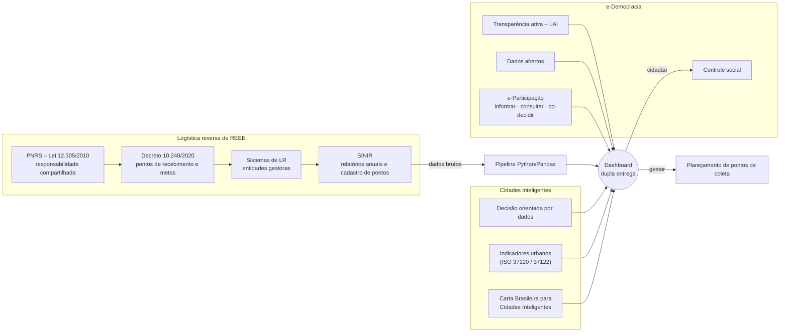

# Objetivo I — Mapeamento conceitual

> Logística reversa de REEE, cidades inteligentes e e-Democracia aplicada ao controle social de resíduos.

Este documento organiza os conceitos que sustentam o protótipo e mostra **como cada um vira uma funcionalidade do dashboard**. As referências ao final são um ponto de partida: confira edição, página e ano no original antes de citar no trabalho.

## 1. Mapa conceitual

## 2. Logística reversa de REEE

**Logística reversa** é definida na Política Nacional de Resíduos Sólidos (Lei nº 12.305/2010, art. 3º, XII) como o conjunto de ações para coletar e devolver resíduos ao setor empresarial, para reaproveitamento ou destinação ambientalmente adequada. O art. 33 torna o sistema obrigatório para produtos eletroeletrônicos e seus componentes, sob **responsabilidade compartilhada** entre fabricantes, importadores, distribuidores, comerciantes, consumidores e poder público.

**REEE** (resíduos de equipamentos eletroeletrônicos) são os produtos que dependem de corrente elétrica ou campo eletromagnético e chegaram ao fim da vida útil. Concentram metais com valor econômico (cobre, ouro, terras-raras) e substâncias perigosas (chumbo, mercúrio, retardantes de chama), o que os torna prioritários tanto para a economia circular quanto para a saúde pública.

**Marco regulatório brasileiro do recorte 2019–2025:**

| Ano | Marco | Efeito para o estudo |
|---|---|---|
| 2010 | PNRS (Lei 12.305) e SINIR | Obrigação de LR e criação do sistema nacional de informações |
| 2019 | Acordo Setorial de Eletroeletrônicos | Início formal do sistema coletivo (fase 1: estruturação) |
| 2020 | Decreto 10.240 | Regras operacionais, pontos de recebimento e metas progressivas |
| 2021–2025 | Fase 2 do Decreto | Metas anuais de municípios atendidos e de peso coletado |
| 2022 | Decreto 10.936 | Nova regulamentação da PNRS, reforça o SINIR |
| 2024 | Portaria GM/MMA 1.011 | Modelo padrão do relatório anual de resultados publicado no SINIR |

Fluxo operacional previsto no Decreto 10.240/2020, que o dashboard modela nas etapas 1 e 2:

1. descarte pelo consumidor em **ponto de recebimento**;
2. recebimento e armazenamento temporário (ponto de recebimento ou de **consolidação**);
3. transporte até o ponto de consolidação, quando necessário;
4. destinação final ambientalmente adequada (reciclagem, recuperação ou disposição).

**Regra de cobertura usada no protótipo** (`src/reee/config.py`): municípios com mais de 80 mil habitantes devem ter ao menos 1 ponto de recebimento para cada 25 mil habitantes. As metas da fase 2 crescem de 24 municípios e 1 % do peso (2021) até 400 municípios e 17 % do peso (2025), tendo como base o peso dos produtos colocados no mercado em 2018. **Confira os valores no Anexo I do Decreto antes de citá-los.**

**Atores.** As entidades gestoras (no Brasil, principalmente ABREE e Green Eletron) organizam os sistemas coletivos; empresas podem manter sistemas individuais. Os municípios não são os responsáveis legais pela LR, mas podem firmar termos de cooperação (cedendo espaço para pontos, por exemplo) e são cobrados pela população quando o sistema falha. Daí a importância de um instrumento municipal de acompanhamento.

## 3. Cidades inteligentes

A literatura converge em três dimensões de cidade inteligente: **tecnologia** (infraestrutura de dados), **gestão** (decisão orientada por evidências) e **pessoas** (participação e capital humano). O protótipo se apoia nas duas últimas:

- **Indicadores urbanos padronizados.** A ISO 37120 (cidades sustentáveis) e a ISO 37122 (cidades inteligentes) incluem indicadores de resíduos sólidos, como percentual reciclado e resíduos perigosos tratados. O protótipo adota a mesma lógica de indicador normalizado por população (pontos por 100 mil hab., kg/hab.).
- **Carta Brasileira para Cidades Inteligentes (2020).** Recomenda transformação digital com inclusão, governança de dados e uso de dados abertos, o que orienta a separação entre visão do gestor e visão do cidadão.
- **Painéis urbanos (urban dashboards).** Ferramentas de apoio à decisão que agregam dados heterogêneos em indicadores visuais. A crítica recorrente é que painéis "tecnocráticos" informam o gestor e excluem o cidadão. A proposta de **dupla entrega** responde diretamente a essa crítica.

## 4. e-Democracia e controle social de resíduos

**e-Democracia** é o uso de tecnologias digitais para ampliar a participação dos cidadãos nas decisões públicas. A **e-participação** costuma ser descrita em níveis crescentes (modelo usado na pesquisa de governo eletrônico da ONU):

| Nível | Significado | Como o dashboard atende |
|---|---|---|
| e-informação | O governo disponibiliza dados | Mapa, indicadores e dados abertos para download |
| e-consulta | O cidadão opina | Formulário de sugestões e avaliação do painel |
| e-decisão | O cidadão influencia a decisão | Sugestões de local alimentam o ranking de prioridade (trabalho futuro) |

**Base legal da transparência:** Lei de Acesso à Informação (Lei 12.527/2011, transparência ativa no art. 8º), Política de Dados Abertos do Executivo Federal (Decreto 8.777/2016) e Lei do Governo Digital (Lei 14.129/2021). **Controle social** é a fiscalização da gestão pública pela sociedade. Aplicado a resíduos, significa permitir que o morador verifique se a cidade tem pontos suficientes, compare com cidades vizinhas e cobre quem é responsável.

## 5. Dos conceitos aos requisitos

| Conceito | Requisito do protótipo | Onde está |
|---|---|---|
| Responsabilidade compartilhada | Mostrar entidade gestora e tipo de ponto | Gestor › "Pontos por entidade gestora" |
| Metas do Decreto 10.240 | Comparar municípios atendidos com a meta anual | Gestor › gráfico "x meta" e KPI |
| Densidade mínima de pontos | Calcular déficit por município | Gestor › KPI, mapa e ranking |
| Decisão orientada por dados | Índice de prioridade e simulador de instalação | Gestor › "Onde instalar os próximos pontos" |
| Indicador normalizado | Pontos/100 mil hab., kg/hab., % pop. coberta | Seletor de indicador do mapa |
| Transparência ativa | Linguagem simples sobre a situação da cidade | Cidadão › ficha do município |
| Dados abertos | CSVs tratados e dicionário de dados | Aba "Dados abertos" |
| e-Consulta | Formulário de contribuição e avaliação | Cidadão › "Participe" e "Avalie" |
| Qualidade da informação | Relatório do que foi limpo/descartado | Dados abertos › "Qualidade dos dados" |

## 6. Referências para aprofundar

- BRASIL. Lei nº 12.305, de 2 de agosto de 2010 (PNRS).
- BRASIL. Decreto nº 10.240, de 12 de fevereiro de 2020.
- BRASIL. Decreto nº 10.936, de 12 de janeiro de 2022.
- BRASIL. Lei nº 12.527, de 18 de novembro de 2011 (LAI).
- BRASIL. Lei nº 14.129, de 29 de março de 2021 (Governo Digital).
- BRASIL. Ministério do Desenvolvimento Regional. *Carta Brasileira para Cidades Inteligentes*. 2020.
- BRASIL. Ministério do Meio Ambiente. Portaria GM/MMA nº 1.011, de 11 de março de 2024.
- ABNT. NBR ISO 37120 e NBR ISO 37122 — Cidades e comunidades sustentáveis.
- BALDÉ, C. P. et al. *Global E-waste Monitor 2024*. ITU/UNITAR.
- LEITE, P. R. *Logística reversa: meio ambiente e competitividade*. São Paulo: Pearson.
- MACINTOSH, A. Characterizing e-participation in policy-making. *HICSS*, 2004.
- ARNSTEIN, S. A ladder of citizen participation. *Journal of the American Institute of Planners*, 1969.
- KITCHIN, R.; LAURIAULT, T.; MCARDLE, G. Knowing and governing cities through urban indicators, city benchmarking and real-time dashboards. *Regional Studies, Regional Science*, 2015.
- UNITED NATIONS. *E-Government Survey* (edição mais recente).
