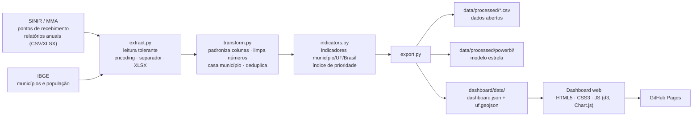

# Objetivos II e III — Dados, tratamento e implementação

## 1. Arquitetura



## 2. Fontes

| Fonte | Conteúdo | Onde obter | Pasta |
|---|---|---|---|
| SINIR (MMA) | Pontos de recebimento de eletroeletrônicos por município e ano | Portal SINIR › Logística reversa › Eletroeletrônicos; relatórios anuais das entidades gestoras publicados no SINIR | `data/raw/sinir/` |
| SINIR (MMA) | Massa recebida/destinada (t) por UF ou município | Relatórios anuais de resultados (Portaria GM/MMA 1.011/2024) | `data/raw/sinir/` |
| IBGE | Cadastro de municípios (código, nome, UF, coordenadas) | Já incluído (`municipios_kelvins.csv`, derivado do IBGE) | `data/raw/ibge/` |
| IBGE | População residente (Censo 2022 ou estimativas anuais) | SIDRA – tabela 4709 (Censo 2022) ou 6579 (estimativas) | `data/raw/ibge/populacao.csv` |
| Malha | Polígonos das UFs | Já incluída (`brazil-states.geojson`) | `data/raw/geo/` |

**Convenção de nomes:** o extrator agrupa arquivos pelo nome. Use `*ponto*` para pontos de recebimento, `*massa*`, `*peso*` ou `*tonelad*` para massa e `*popul*` para população. O ano é lido da coluna `ano` ou, na falta dela, do último ano que aparece no nome do arquivo (`pontos_2023.csv`).

**Layouts diferentes entre anos** são resolvidos por apelidos de coluna em `config.py` (`ALIASES_PONTOS`, `ALIASES_MASSA`, `ALIASES_POP`). Se uma exportação nova usar outro cabeçalho, acrescente o apelido; nenhum outro código muda.

## 2.1 Coleta automática e dados declaratórios

`src/reee/coleta.py` consulta a API CKAN do portal do MMA (`/api/3/action/package_show?id=sinir`) e seleciona os recursos do **módulo Estados e Municípios**, identificando o ano pelo nome ou pela URL. Se a API falhar, usa a lista de URLs conferida em 08/10/2026. Cada download registra URL, data de modificação, tamanho, SHA-256 e data da coleta em `data/raw/sinir/manifesto.json`. Essa proveniência aparece na aba Dados abertos do painel e só é baixada de novo quando muda no portal.

`src/reee/adaptador_sinir.py` lê todas as abas de todas as planilhas extraídas e:

| Etapa | Como decide |
|---|---|
| Linha de cabeçalho | Linha (entre as 25 primeiras) com mais textos, com bônus se cita município/IBGE/UF; se a linha de cima tiver grupos, os nomes viram "Grupo · Coluna" |
| Código IBGE | Coluna em que ≥ 60 % dos valores são códigos IBGE válidos (7 ou 6 dígitos), com bônus pelo nome |
| Campo `pontos` | Nome cita eletroeletrônicos **e** ponto/PEV/local de entrega, de preferência com "quantidade"; valores inteiros |
| Campo `toneladas` | Nome cita eletroeletrônicos **e** massa/peso/toneladas/kg; kg é convertido para t |
| Campo `possui` | Nome cita eletroeletrônicos e "possui/existe/há"; valores Sim/Não |
| Formato longo | Se houver colunas Pergunta/Resposta, filtra as perguntas sobre eletroeletrônicos e as transforma em colunas |

**Tratamento de lacunas.** Município que não aparece no arquivo do ano, ou que aparece sem responder sobre eletroeletrônicos, fica **sem informação** (nulo), e nunca com zero pontos. Quem respondeu "Sim" sem informar quantidade conta como 1 ponto (mínimo declarado, marcado em `pontos_estimado`). O painel mostra o percentual de municípios com informação em cada ano e exclui quem não informou do déficit e do ranking.

## 2.2 Planos municipais: classificação dos textos

O módulo Estados e Municípios do SINIR não tem campos numéricos de REEE (verificado nos arquivos de 2019 a 2024 com `scripts/procurar_reee.py`). Ele traz, porém, os **planos de gestão de resíduos** declarados pelos municípios, com metas, programas e soluções compartilhadas em texto livre. `src/reee/planos_sinir.py` transforma esses textos num indicador:

| Etapa | Regra |
|---|---|
| Arquivos | Planilhas cujo nome contém "Municipal" (Diagnóstico, Soluções Compartilhadas, Mecanismo para Criação de Fonte) |
| Município | `Município Declarante` + `UF Declarante` casados com o IBGE pelo nome; grafias próximas (≥ 0,88 de semelhança) são aceitas e registradas |
| Colunas lidas | `Meta - Programa`, `Meta - Programa - Descritivo`, `Solução`, `Solução Consórcio`, `Descrição Mecanismo Fonte` |
| Cita REEE | eletroeletrônico(s), eletrodoméstico(s), lixo/sucata eletrônica, resíduos/equipamentos eletrônicos, REEE, e-lixo, "eletrônicos" no plural |
| Falsos positivos excluídos | nota fiscal eletrônica, MTR/sistema/meio/processo/documento/ponto eletrônico, entre outros |
| Cita logística reversa | "logística reversa" (registrado à parte; não conta como REEE) |
| Evidência | Trecho de até ~160 caracteres do texto original, com palavras inteiras |

Indicadores: `planos_declarados` (municípios com plano declarado no ano), `planos_citam_reee` e `pct_planos_reee`. **Limite:** citar não prova execução, e não citar não prova ausência de ação. O painel exibe o trecho original para que o leitor julgue.

## 3. Regras de tratamento (Pandas)

| Problema encontrado | Regra | Registro em `qualidade.json` |
|---|---|---|
| Encoding latin-1 vs UTF-8 | Tenta UTF-8 com BOM, depois latin-1 | – |
| Separador `;` vs `,` | `csv.Sniffer` sobre os primeiros 5 KB | – |
| Cabeçalhos diferentes | Normaliza (sem acento, minúsculas) e casa com apelidos | – |
| Número no formato brasileiro (`1.234,56`) | `numero_br()` converte para float | `massa_valores_invalidos` |
| Código IBGE ausente ou inválido | Recupera pela chave nome+UF normalizada | `*_codigo_recuperado_por_nome` |
| Município não identificável | Linha descartada e exemplos listados | `*_sem_municipio_descartados` |
| Ponto inativo/desativado | Removido | `pontos_inativos_removidos` |
| Registro duplicado | `id_ponto + ano` (ou chave composta) | `pontos_duplicados_removidos` |
| Ano fora de 2019–2025 | Removido | `pontos_fora_do_periodo` |
| Massa só por UF em alguns anos | Mantida em tabela própria; UF usa o municipal quando houver | coluna `fonte_massa` |
| Valor de massa atípico | Sinalizado (z > 6), **não** removido | `massa_outliers_sinalizados` |

## 4. Indicadores

| Indicador | Fórmula | Nível |
|---|---|---|
| `pontos` | contagem de pontos ativos | município, UF, Brasil |
| `pontos_necessarios` | ⌈pop ÷ 25.000⌉ se pop > 80.000, senão 0 | município |
| `deficit_pontos` | max(0, necessários − pontos) | todos |
| `com_ponto` | pontos > 0 | município |
| `cumpre_densidade` | obrigado e pontos ≥ necessários | município |
| `pct_pop_coberta` | pop. em município com ponto ÷ pop. total × 100 | UF, Brasil |
| `pct_obrigados_com_ponto` | obrigados com ponto ÷ obrigados × 100 | UF, Brasil |
| `pontos_100k` | pontos ÷ pop × 100.000 | todos |
| `kg_hab` | t × 1.000 ÷ pop | todos |
| `meta_municipios` | meta acumulada da fase 2 do Decreto | Brasil |
| `indice_prioridade` | 100 × (0,45·déficit\* + 0,30·pop. descoberta\* + 0,15·lacuna de coleta + 0,10·sem ponto) | município candidato |

\* normalizados por min–max sobre log(1+x) entre os candidatos. **Candidatos:** municípios obrigados com déficit e municípios com 20 mil hab. ou mais sem nenhum ponto. **Classes:** 20 % maiores = Alta, 40 % seguintes = Média, demais = Baixa.

**Simulador de instalação.** Percorre os candidatos em ordem de índice e instala em cada um o necessário para zerar o déficit (1 ponto, se não for obrigado) antes de passar ao próximo, até esgotar o número de pontos escolhido. Mostra municípios atendidos, quantos passam a cumprir o Decreto, população que ganha o primeiro ponto e déficit restante.

## 5. Implementação do dashboard

- **Sem etapa de build**: HTML5, CSS3 e JavaScript puro; d3 (mapa) e Chart.js (gráficos) via CDN.
- **Dados estáticos**: `dashboard.json` (~850 KB) e `uf.geojson` (~870 KB) gerados pelo pipeline, servidos pelo GitHub Pages.
- **Três abas**: Gestor público, Cidadão e Dados abertos; filtros globais de ano e UF.
- **Acessibilidade**: tema claro/escuro automático, estado nunca indicado só por cor (rótulo + ícone), navegação por teclado no ranking, tabela de dados disponível para todo gráfico.
- **e-Participação** guardada em `localStorage` no protótipo; o ponto de integração com ouvidoria/Fala.BR é o handler `submit` de `#form-part` em `js/app.js`.

## 6. Alternativa em Power BI

O pipeline também grava um modelo estrela em `data/processed/powerbi/`:

```
dim_municipio (cod_ibge PK) ─┬─< fato_municipio_ano (cod_ibge, ano)
                             └─< fato_ponto_ano     (cod_ibge, ano)
dim_ano (ano PK) ────────────┬─< fato_municipio_ano
                             └─< fato_ponto_ano
```

Medidas DAX sugeridas:

```dax
Pontos = SUM(fato_municipio_ano[pontos])
Toneladas = SUM(fato_municipio_ano[toneladas])
Populacao = SUM(fato_municipio_ano[populacao])
Pontos por 100 mil = DIVIDE([Pontos], [Populacao]) * 100000
kg por hab = DIVIDE([Toneladas] * 1000, [Populacao])
Obrigados com ponto =
    CALCULATE(DISTINCTCOUNT(fato_municipio_ano[cod_ibge]),
              fato_municipio_ano[obrigado_decreto] = TRUE(), fato_municipio_ano[pontos] > 0)
Meta municipios = MAX(dim_ano[meta_municipios])
Atingiu meta = IF([Obrigados com ponto] >= [Meta municipios], "Sim", "Não")
Deficit = SUM(fato_municipio_ano[deficit_pontos])
```

Visuais equivalentes: mapa coroplético por UF (pontos por 100 mil), gráfico de colunas com linha de meta, matriz de prioridade ordenada por `prioridade_novos_pontos.csv`, segmentação por ano e UF.

## 7. Reprodutibilidade

```bash
pip install -r requirements.txt
pip install -e .
python -m reee.servidor                         # coleta, trata e abre o painel (atualiza em tempo de execução)
python -m reee.pipeline --coletar               # o mesmo, sem servidor
python -m reee.pipeline --demo                  # dados sintéticos, sem internet
python -m pytest                                # 18 testes (inclui portal MMA/IBGE simulado)
```
