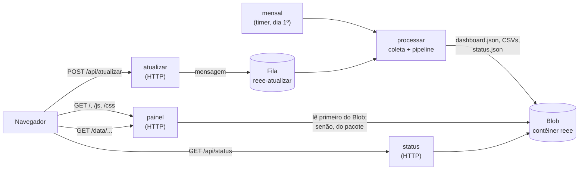

# Implantação no Azure Functions

O painel roda inteiro num **Function App Linux (Python 3.12)**, sem servidor próprio:



| Função | Gatilho | O que faz |
|---|---|---|
| `painel` | HTTP `GET /{*caminho}` | Serve `index.html`, CSS, JS e `data/…` |
| `status` | HTTP `GET /api/status` | Estado da última atualização (lido do Blob) |
| `atualizar` | HTTP `POST /api/atualizar` | Coloca um pedido na fila. Responde 409 se já há uma execução e 429 se a última terminou há menos de 30 min |
| `processar` | Fila `reee-atualizar` | Coleta SINIR/IBGE, roda o pipeline em `/tmp` e publica no Blob |
| `mensal` | Timer `0 0 9 1 * *` | A mesma atualização, todo dia 1º às 06:00 (Brasília) |

As rotas são as mesmas do servidor local (`src/reee/servidor.py`), então o JavaScript do painel é o mesmo nos dois ambientes. O `host.json` remove o prefixo `api` padrão do Functions (`"routePrefix": ""`) e limita cada execução a 10 minutos.

## 1. Criar os recursos (uma vez)

Com a [Azure CLI](https://learn.microsoft.com/cli/azure/install-azure-cli) instalada e `az login` feito:

```bash
GRUPO=rg-painel-reee
LOCAL=brazilsouth
STORAGE=stpainelreee$RANDOM     # precisa ser único no Azure, só minúsculas e números
APP=painel-reee                 # vira https://painel-reee.azurewebsites.net (também precisa ser único)

az group create -n $GRUPO -l $LOCAL
az storage account create -n $STORAGE -g $GRUPO -l $LOCAL --sku Standard_LRS
az functionapp create -n $APP -g $GRUPO --storage-account $STORAGE \
  --consumption-plan-location $LOCAL --os-type linux \
  --runtime python --runtime-version 3.12 --functions-version 4
```

A conta de armazenamento é a mesma que o Functions usa internamente (`AzureWebJobsStorage`). O painel cria nela, sozinho, o contêiner `reee` e a fila `reee-atualizar`.

Configurações opcionais, em **Function App › Settings › Environment variables**:

| Variável | Padrão | Para quê |
|---|---|---|
| `REEE_BLOB_CONTEINER` | `reee` | Nome do contêiner dos dados |
| `REEE_INTERVALO_MINIMO_MIN` | `30` | Minutos mínimos entre duas atualizações pedidas pelo botão |
| `REEE_BLOB_CONEXAO` | `AzureWebJobsStorage` | Use outra conta de armazenamento para os dados |

## 2. Ligar o GitHub ao Azure

1. No portal, abra o Function App e clique em **Get publish profile**. Se o botão estiver desativado, ative **Configuration › General settings › SCM Basic Auth Publishing Credentials** e salve.
2. No GitHub, em **Settings › Secrets and variables › Actions**:
   - **Secret** `AZURE_FUNCTIONAPP_PUBLISH_PROFILE`: o conteúdo inteiro do arquivo baixado.
   - **Variable** `AZURE_FUNCTIONAPP_NAME`: o nome do app (ex.: `painel-reee`).
3. Em **Settings › Environments**, crie o environment `dev`. Se quiser, exija aprovação antes do deploy.

## 3. Publicar

Faça push na branch `main` ou rode o workflow **Deploy do painel no Azure Functions** pela aba Actions. O workflow [`azure-functions.yml`](../.github/workflows/azure-functions.yml) faz quatro coisas:

1. roda os testes;
2. atualiza os dados que vão dentro do pacote, que são o plano B do painel enquanto o Blob está vazio;
3. publica com build remoto (Oryx), que instala o `requirements.txt` já compilado para o Linux do Functions;
4. confere se `/api/status`, `/` e `/data/dashboard.json` respondem.

Depois do primeiro deploy, abra o painel e clique em **Atualizar dados**, ou espere o dia 1º. A partir daí os dados passam a vir do Blob.

## 4. Testar localmente com o runtime do Functions (opcional)

```bash
npm install -g azure-functions-core-tools@4 azurite
azurite --silent --location .azurite &          # emulador do Storage
cp local.settings.json.example local.settings.json
pip install -r requirements.txt
func start                                      # http://localhost:7071
```

Os testes `tests/test_azure.py` cobrem as funções sem precisar do runtime nem do Azure: usam uma pasta local no lugar do Blob.

## Limites e cuidados

- **Tempo de execução.** No plano Consumption, cada execução tem no máximo 10 minutos. A coleta completa costuma caber nisso porque os downloads ficam pequenos depois de extraídos. Se não couber, use o plano Flex Consumption ou Premium e aumente `functionTimeout` no `host.json`.
- **RAR de 2025.** O Linux do Functions não tem 7-Zip nem `unar`, então o arquivo RAR de 2025 é registrado como falha da coleta e os demais anos seguem. O pacote publicado pelo workflow já inclui os dados processados no GitHub Actions, onde o `unar` é instalado.
- **Botão público.** `POST /api/atualizar` é anônimo para o botão funcionar sem chave. A proteção é o intervalo mínimo e a execução única. Para restringir, troque `http_auth_level` dessa rota para `FUNCTION` e informe a chave no painel.
- **Custo.** No plano Consumption, um painel acadêmico com poucas atualizações por mês tende a ficar dentro da cota gratuita mensal de execuções. Confira os valores atuais na página de preços do Azure.
